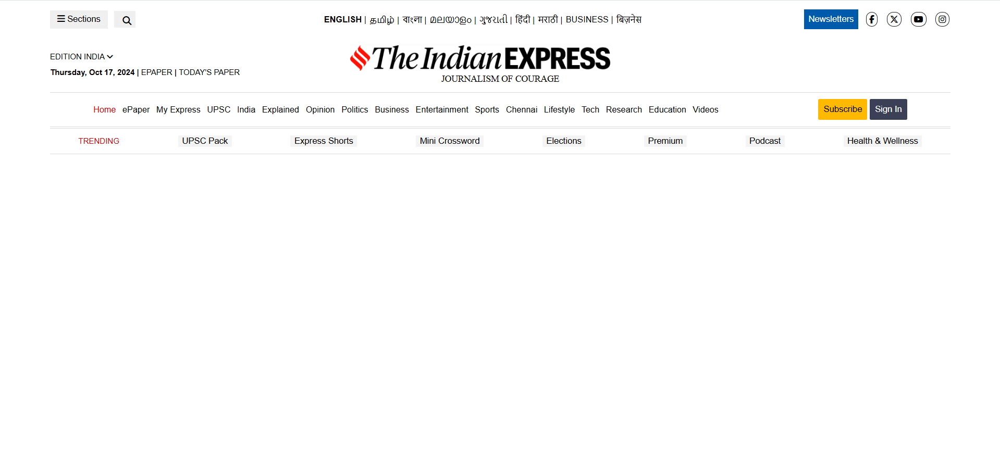

# 📰 Indian Express Header Clone

A static clone of the **Indian Express website's header section** built using HTML and CSS. This project focuses on recreating a responsive news website header with logo, navigation menu, and search bar styling.

---

## 🔧 Technologies Used

- HTML5
- CSS3

---

## 📷 Screenshot



---

## 🚀 How to Run

You can view the header layout by opening the `index.html` file in your browser:

```bash
1. Download or clone the repository
2. Open the folder in VS Code or File Explorer
3. Double-click on index.html OR open it in a browser manually
````

---

## 📁 Folder Structure

```
indian-express-header/
├── images/
│   └── screenshot.png
├── index.html
├── style.css
└── README.md
```

---

## 📌 Note

This is a **static layout clone** of the header portion only — no interactive functionality is included.

---

## 🌐 Live Demo

[Click here to view the live Indian Express Header Clone](https://Pavithra-Christy.github.io/indian-express-header/)

---

